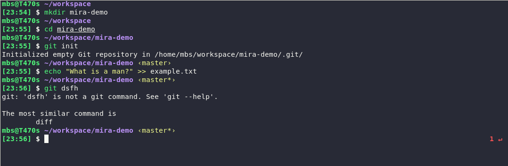

# Mira 

A modified [bira][1] with time info and a simplified start prompt.



# Installation

The easiest way to use this theme is to install [Antigen][2] and add the following to your `.zshrc`:

```sh
antigen theme https://github.com/mbStavola/mira
```

[1]: https://github.com/ohmyzsh/ohmyzsh/wiki/Themes#bira
[2]: https://github.com/zsh-users/antigen
